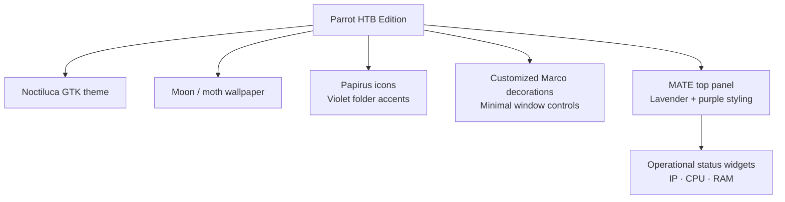
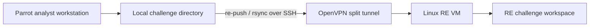
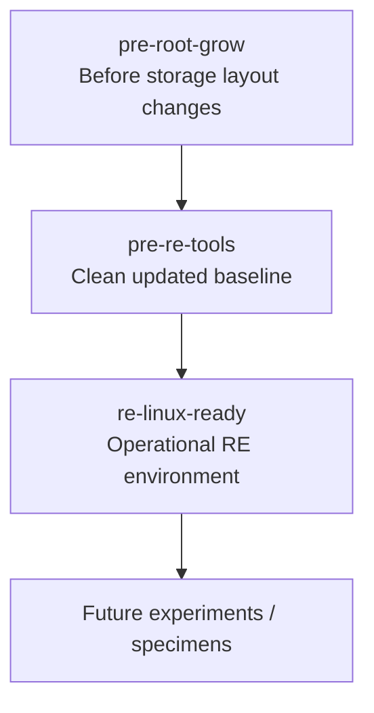
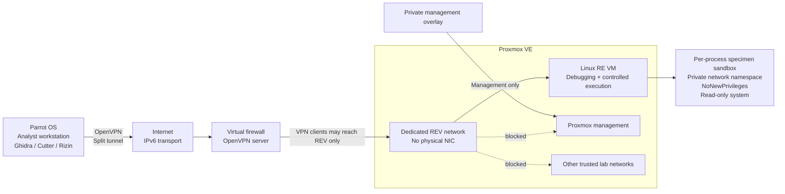
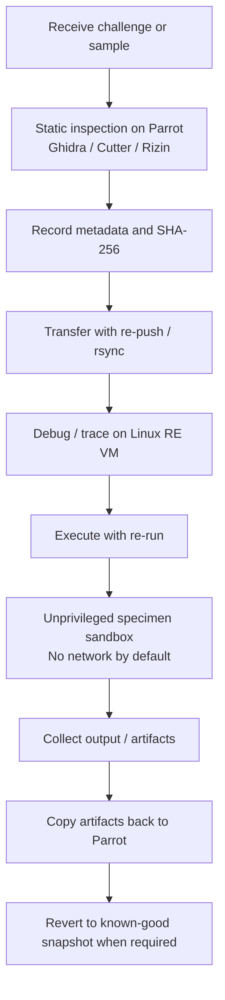
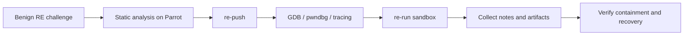

# Reverse Engineering Lab Bootstrap and Remote Analysis Workflow

**Date:** 23 September 2026  
**Environment:** Home Lab / dedicated reverse-engineering segment  
**Platform:** Proxmox VE 9.2  
**Primary analysis workstation:** Parrot OS HTB Edition  
**Execution target:** Debian 13 reverse-engineering VM  
**Network control:** OPNsense  
**Status:** Operational baseline completed

> **Public documentation note:** Exact internal addressing, public endpoints, certificate details, firewall object names, management routes, and other operational identifiers are intentionally omitted or generalized.

## 1. Goal

The goal of this build session was to create a dedicated reverse-engineering environment that is separated from the normal Active Directory lab, home network, and Proxmox management plane.

The environment should support two different roles:

- **Parrot OS** as the analyst workstation for graphical and interactive reverse engineering,
- **a dedicated Linux VM** as the controlled execution and debugging target.

The intended workflow is deliberately split instead of installing every tool on every system.

Parrot provides the analyst-facing tools, while the Linux VM provides a recoverable and more tightly controlled place to execute binaries, attach debuggers, trace processes, and collect artifacts.

Remote access to the reverse-engineering network is provided through a dedicated OpenVPN path rather than granting the analysis workstation direct access to the rest of the home lab.

## 2. Design Principles

The build followed several basic principles.

### 2.1 Separate analysis from administration

The private management path used to administer Proxmox is separate from the VPN used to reach the reverse-engineering segment.

The reverse-engineering VPN therefore does not become a general-purpose home-lab VPN.

### 2.2 Default-deny lateral access

Systems inside the reverse-engineering segment must not be able to initiate connections into:

- the normal home network,
- the Active Directory lab,
- the Proxmox management plane,
- other private VPN segments.

### 2.3 Restrict execution by default

Unknown binaries should not run as the administrative account.

A dedicated unprivileged execution account is used, and the default execution wrapper removes network access and restricts filesystem writes.

### 2.4 Preserve rollback points

Known-good snapshots are created before major changes and before the environment begins handling untrusted binaries.

### 2.5 Keep the public repository sanitized

The architecture and lessons are documented, but exact operational values are intentionally omitted.

## 3. Reverse-Engineering Network

A dedicated internal Proxmox bridge was created for the reverse-engineering environment.

The bridge:

- has no physical network interface,
- is separate from the existing Active Directory bridge,
- is not used for Proxmox management,
- connects to a dedicated OPNsense interface,
- provides the network boundary for the reverse-engineering VM.

An initially planned subnet was not used because it was already assigned to an existing private VPN segment.

A separate subnet was selected instead.

This avoided overlapping routes and kept the existing network design intact.

## 4. OPNsense Segmentation

A dedicated OPNsense interface was created for the reverse-engineering segment.

The firewall policy explicitly prevents systems in that segment from initiating traffic toward other trusted networks.

Blocked destinations include:

- the normal home LAN,
- the Active Directory lab,
- the Proxmox management host,
- the existing private management VPN segment,
- the firewall itself except where explicitly required.

Controlled outbound access is available only for selected infrastructure and web protocols required for package management and system maintenance.

The result is a network that can update and retrieve approved dependencies without becoming another fully trusted internal network.

## 5. Reverse-Engineering Linux VM

A Debian template was used to create the dedicated Linux reverse-engineering VM.

The VM was configured with:

| Resource | Configuration |
|---|---|
| Operating system | Debian 13 |
| vCPU | 4 |
| RAM | 8 GB |
| Disk | 80 GB |
| Network | Dedicated REV bridge only |
| QEMU Guest Agent | Enabled |
| Addressing | Static inside the isolated segment |

The machine was kept headless.

Graphical analysis remains on the Parrot workstation, while the Debian VM acts as the controlled execution and debugging target.

## 6. Storage Cleanup and Swap Migration

The cloned Debian image initially retained the partition layout of the smaller template disk.

The virtual disk was already enlarged, but the guest filesystem did not initially use the full capacity.

The legacy swap partition was removed and the root filesystem was expanded to use the available space.

A swap file was then created instead of recreating a dedicated swap partition.

Final state:

- root filesystem expanded to approximately the full virtual disk,
- dedicated swap partition removed,
- 4 GB swap file configured,
- persistent swap configuration verified.

A snapshot was created before the partition changes so the operation could be reversed if required.

## 7. Package State and Kernel Baseline

The cloned system had an interrupted package-management state during the initial setup.

The following recovery steps were used:

```bash
sudo dpkg --configure -a
sudo apt-get -f install
sudo apt update
sudo apt upgrade
```

The system was then rebooted into the updated Debian kernel.

After the reboot, the package state was clean and the new kernel was active.

A second snapshot was created before installing reverse-engineering tooling.

## 8. Remote Access Architecture

Remote access to the reverse-engineering segment is provided through OpenVPN on OPNsense.

The VPN is intentionally separate from the private management overlay used to administer the home lab.

The two access paths have different responsibilities:

- **management overlay:** administration of the virtualization environment,
- **OpenVPN:** access from the Parrot workstation to the reverse-engineering segment only.

The OpenVPN deployment uses:

- certificate-based client authentication,
- a dedicated internal certificate authority,
- a dedicated server certificate,
- a dedicated client certificate,
- TLS control-channel authentication,
- split tunneling,
- only the reverse-engineering network being pushed to the client.

Username/password authentication is not required for the VPN connection.

## 9. IPv6 Transport and CGNAT Discovery

During setup, the home Internet connection was found to use a shared carrier-grade IPv4 address.

This meant a conventional inbound IPv4 port-forward could not be relied upon for remote OpenVPN access.

The firewall VM already had globally reachable IPv6 connectivity.

The OpenVPN transport was therefore changed to IPv6 while the tunnel itself continues to carry the private IPv4 reverse-engineering network.

The design therefore separates:

- the **transport network** used to reach the OpenVPN server,
- the **private tunnel network** assigned to VPN clients,
- the **reverse-engineering subnet** reached through the tunnel.

This also avoided placing the OpenVPN traffic inside the private management overlay.

The management overlay remains dedicated to infrastructure administration; OpenVPN is an independent remote-access path for the reverse-engineering environment.

## 10. OpenVPN Client Validation

The Parrot VM was verified to have working outbound IPv6 connectivity before attempting the connection.

The exported OpenVPN client configuration contained:

- the client PKCS#12 certificate bundle,
- the TLS authentication key,
- the OpenVPN client profile.

The credential material was copied out of the shared host folder and stored in a private configuration directory on Parrot with restrictive filesystem permissions.

The client profile was inspected before use to confirm:

- IPv6 UDP transport,
- the expected remote endpoint,
- server certificate verification,
- the client certificate bundle,
- the TLS authentication key.

The connection completed successfully with:

```text
Initialization Sequence Completed
```

The Parrot VM then received a VPN client address and the route to the reverse-engineering network.

SSH access to the Linux RE VM succeeded through that tunnel.

## 11. Parrot Analysis Workstation

Parrot remains the primary analyst workstation.

It already provides the graphical static-analysis layer, including:

- Ghidra,
- Cutter,
- Rizin,
- general CTF and security tooling.

This avoided duplicating large GUI-oriented applications on the headless Debian VM.

The division of responsibilities is now:

| System | Primary Role |
|---|---|
| Parrot OS | GUI analysis, static analysis, analyst workspace, VPN client |
| Linux RE VM | debugging, tracing, controlled execution, binary exploitation helpers |


### 11.1 Parrot VM Baseline and the Noctiluca Sidequest

The Parrot workstation was not treated as a disposable default security VM.

Because it is intended to remain the primary analyst-facing system, it was also
customized into a recognizable and comfortable long-term workspace.

The VM runs Parrot HTB Edition in VirtualBox with a lightweight workstation
configuration suitable for CTF, reverse-engineering, and remote-lab access.

The local machine was given the hostname:

```text
lucerna-noctis
```

A persistent VirtualBox shared folder was also configured and mounted at:

```text
/mnt/vm-share
```

This became a convenient temporary handoff location between the host system and
Parrot. Sensitive VPN material was not left there after import; it was copied
into a private configuration directory with restrictive permissions.

Several small integration problems were fixed during setup:

- VirtualBox host integration was updated and mouse behavior was verified,
- the persistent shared-folder mount was corrected,
- an `/etc/hosts` hostname typo was removed,
- the panel background was corrected after individual applets rendered with
  inconsistent dark blocks,
- window controls were moved to the right side.

The visual customization was built around a custom theme named **Noctiluca**.

The resulting workstation uses:

- a dark purple / lavender visual language,
- a custom moon-and-moth wallpaper,
- the `Noctiluca` GTK theme,
- a customized Marco window-decoration theme,
- Papirus icons with violet folder accents,
- minimalist window controls using `─`, `□`, and `×`,
- window controls positioned on the right,
- a lavender MATE top panel with a purple edge,
- dark panel text and icons for contrast.

The custom Marco theme was derived from an existing dark theme and then modified
rather than rebuilding all window-decoration assets from scratch.

The customization stack can be summarized as:



This visual work was a sidequest rather than a security requirement, but it
serves two practical purposes:

1. the analyst workstation is immediately recognizable from the other lab
   systems;
2. a comfortable and consistent desktop is useful for long debugging and
   reversing sessions.

The final panel-status widgets are documented separately later in this report
because they provide operational information rather than only visual
customization.


## 12. CLI Reverse-Engineering Tooling

The Linux RE VM received a focused CLI toolset rather than a large prebuilt distribution.

Installed baseline tools include:

- `file`
- `binutils`
- `xxd`
- `elfutils`
- `patchelf`
- `strace`
- `ltrace`
- `gdb`
- `gdb-multiarch`
- `checksec`
- `nasm`
- `libc6-dbg`
- multi-architecture binutils
- Git
- build-essential
- Python 3
- Python virtual-environment support
- curl and wget

Additional reverse-engineering and exploitation helpers include:

- pwndbg
- pwntools
- ROPgadget
- ropper

`ropper` was installed with `pipx` to avoid modifying Debian's system Python environment.

The user-local executable path was added to the shell environment and verified.

## 13. Tool Verification

The tools were not treated as installed merely because package installation completed.

Basic verification included:

- running `checksec` against a system binary,
- opening a system binary in pwndbg,
- confirming debug symbols could be retrieved,
- verifying pwntools could inspect ELF protections,
- confirming ROPgadget and ropper were callable,
- checking compiler, debugger, Python, and tracing tool versions.

This produced a known-working CLI analysis baseline before moving to specimen handling.

## 14. Analyst Workspace

The Linux RE VM uses a simple workspace under the analyst account.

Directories were created for:

- pristine samples,
- challenges,
- scripts,
- notes,
- collected artifacts.

This separates source material from execution workspaces and makes the transfer workflow predictable.

## 15. Dedicated SSH Key

A dedicated Ed25519 SSH key was generated on Parrot specifically for access to the Linux RE VM.

The key is not reused for other infrastructure.

The private key remains on Parrot and the public key was installed on the Linux RE VM.

An SSH host alias was added so the analyst can connect using a short command rather than repeating addresses and identity-file paths.

SSH client keepalives were also enabled for this host to reduce stale sessions when the terminal is left idle for longer periods.

## 16. SSH Hardening

After key-based access was verified, SSH on the Linux RE VM was hardened.

The effective policy is:

```text
Public-key authentication:      enabled
Password authentication:        disabled
Keyboard-interactive login:     disabled
Direct root SSH login:          disabled
```

The SSH configuration was validated before reloading the daemon.

A second independent SSH session was then opened to confirm that key-based access still worked.

A negative test also verified that password-only authentication fails.

## 17. Visual Host Identification

During setup, commands were accidentally entered into the wrong terminal more than once because Parrot and the remote Debian shell were both open simultaneously.

The Linux RE VM shell prompt was therefore changed to include an explicit marker:

```text
[RE-LAB]
```

This is a small usability change, but it reduces the chance of executing administrative or destructive commands on the wrong machine.

In this context, visual differentiation is part of operational safety rather than decoration.

## 18. File Transfer Workflow

A dedicated file-transfer workflow was created between Parrot and the Linux RE VM.

Single files can be transferred through SSH with `scp`.

For whole challenge directories, `rsync` is available on both systems.

A small Parrot-side helper named `re-push` wraps the common directory-sync operation.

The intended workflow is:



A test directory was successfully transferred and verified on the remote system.

## 19. Dedicated Specimen User

Potentially untrusted binaries are not intended to run as the normal administrative account.

A separate local account dedicated to specimen execution was created.

Properties of this account include:

- no sudo membership,
- no administrative role,
- private execution directories,
- separate inbox, work, and output locations.

The specimen workspace is inaccessible to normal users without deliberate elevation.

## 20. Sandboxed Execution Wrapper

A helper named `re-run` was created to execute samples using `systemd-run`.

The wrapper performs the following steps:

1. resolves and validates the requested sample,
2. calculates and prints its SHA-256 hash,
3. copies the sample into the specimen work directory,
4. changes ownership to the unprivileged specimen account,
5. launches the sample inside a transient systemd sandbox.

The sandbox currently applies:

- unprivileged specimen user and group,
- private network namespace,
- no normal network interfaces,
- no default route,
- `NoNewPrivileges=yes`,
- private temporary directory,
- read-only system filesystem,
- explicit writable work and output directories,
- protected kernel tunables,
- protected kernel modules,
- protected control groups,
- SUID/SGID restrictions.

The wrapper requires administrative elevation for the setup plumbing, but the sample itself executes as the unprivileged specimen account.

## 21. Containment Verification

The execution wrapper was tested before being trusted with unknown binaries.

The test confirmed:

- the process runs as the dedicated specimen account,
- only the loopback interface is visible,
- no network route exists,
- the specimen work directory is writable,
- `/etc` is read-only,
- a blocked write attempt leaves no file behind.

The test output included the expected filesystem error:

```text
Read-only file system
```

This verifies that the configured systemd restrictions are active rather than merely present in the wrapper script.

The wrapper is not treated as a complete malware sandbox by itself.

It is one additional containment layer inside an already isolated VM and network.

## 22. Snapshot Strategy

Three useful snapshots now exist around the RE VM build process.



The final known-good snapshot was created only after:

- networking was validated,
- reverse-engineering tools were verified,
- SSH hardening was tested,
- file transfer worked,
- the specimen user existed,
- the sandbox passed its containment test.

This snapshot is the normal rollback point before future experimental work.

## 23. Proxmox Thin-Pool Warning

Snapshot creation produced an LVM-thin warning.

The configured maximum sizes of all thin-provisioned virtual disks exceed the physical thin pool capacity.

This does not mean the pool is currently full, but it does mean capacity must be monitored carefully.

The host also warned that automatic thin-pool extension protection is not currently configured.

This remains an infrastructure follow-up task.

A full thin pool could affect multiple virtual machines and should therefore be treated as a separate reliability concern before the lab grows significantly further.

## 24. Parrot Panel Status Widgets

The Parrot top panel previously contained several clock applets that were not useful for the RE workflow.

They were replaced with three command-driven status widgets in the following order:

| Position | Widget | Purpose |
|---|---|---|
| Left | IP | Shows VPN address when the RE VPN is active, otherwise the normal workstation address |
| Middle | CPU | Shows current CPU utilization |
| Right | RAM | Shows current memory utilization |

The IP widget dynamically detects the OpenVPN tunnel interface.

When OpenVPN is active, it displays the VPN-side address.

When OpenVPN is stopped, it automatically falls back to the normal workstation address.

The OpenVPN process was stopped cleanly and the widget transition was verified.

## 25. Current Architecture



The important separation is that the management overlay and the OpenVPN analysis path are not the same trust path.

## 26. Analysis Workflow



The default workflow therefore favors static analysis first and controlled execution later.

## 27. Problems Encountered

### 27.1 Planned subnet already in use

The originally planned reverse-engineering subnet was already assigned to an existing VPN segment.

The new network was moved to a separate range instead of attempting to reuse or renumber an established service.

### 27.2 Remote firewall administration

The firewall GUI was not directly reachable from the remote workstation.

A temporary management path through the Proxmox host was used while configuration was performed.

This was intentionally separate from the final RE access path.

### 27.3 CGNAT prevented normal inbound IPv4

The home router's external IPv4 address was part of a shared carrier-grade range.

OpenVPN was therefore moved to IPv6 transport rather than pretending an IPv4 port forward would provide public reachability.

### 27.4 Browser reached the wrong router

The analyst workstation was remote and the hostname normally used for the home router resolved to a different local device on the current network.

The router was instead accessed through an explicit SSH tunnel to the home-lab side.

This avoided modifying DNS-rebind protection merely to make the remote browser workflow easier.

### 27.5 SSH sessions appeared frozen after idle periods

Long-idle SSH sessions sometimes remained visually open while no longer responding.

SSH client keepalives were added for the RE host so stale connections are detected and intermediate state is refreshed periodically.

### 27.6 Wrong-terminal commands

With Parrot, Proxmox, and the RE VM open simultaneously, a few commands were entered into the wrong terminal.

The explicit `[RE-LAB]` shell prompt was added as a simple human-factor control.

### 27.7 Private specimen directory blocked the wrapper

The specimen workspace was intentionally configured with restrictive permissions.

The first execution-wrapper attempt failed because the administrative user could not traverse into that directory.

The wrapper was changed so privileged setup occurs through `sudo`, while the actual sample still executes as the unprivileged specimen account.

## 28. Current State

Completed:

- dedicated reverse-engineering virtual network created
- OPNsense interface created for the RE network
- lateral access to trusted networks blocked
- controlled outbound maintenance access verified
- Debian RE VM cloned and configured
- root filesystem expanded
- swap moved to a swap file
- package state repaired and system updated
- current Debian kernel verified after reboot
- OpenVPN server created
- certificate-only client authentication configured
- split-tunnel route limited to the RE network
- IPv6 VPN transport configured because of upstream CGNAT
- Parrot IPv6 connectivity verified
- OpenVPN client exported and connected successfully
- SSH to the RE VM verified through the VPN
- CLI reversing and debugging toolset installed
- pwndbg verified
- pwntools verified
- ROPgadget verified
- ropper installed in an isolated pipx environment
- dedicated analyst workspace created
- dedicated SSH key created for RE access
- SSH host alias configured
- password-based SSH disabled
- direct root SSH disabled
- negative SSH authentication test passed
- SSH keepalives configured
- rsync workflow verified
- `re-push` helper created
- dedicated unprivileged specimen account created
- specimen workspace permissions restricted
- `re-run` systemd execution wrapper created
- network isolation verified inside the execution sandbox
- read-only system filesystem verified
- known-good RE snapshot created
- Parrot IP / CPU / RAM status widgets created and verified

## 29. Not Yet Completed

The main remaining infrastructure tasks are:

- configure and verify thin-pool capacity protection on Proxmox,
- monitor actual thin-pool usage before adding more large VM disks,
- replace the literal remote IPv6 endpoint with a stable DNS/DDNS name,
- document the exact recovery procedure for reverting the RE VM,
- create a repeatable sample-analysis note template,
- decide whether network-enabled specimen execution needs a separate opt-in wrapper,
- test the complete workflow with a benign reversing challenge before handling genuinely untrusted specimens.

## 30. Lessons Learned

1. A reverse-engineering lab benefits from separating the analyst workstation from the execution target.
2. A management VPN and an analysis VPN can coexist cleanly when they have different scopes and routes.
3. Carrier-grade IPv4 NAT should be discovered before designing inbound services around IPv4 port forwarding.
4. IPv6 transport can solve remote reachability without changing the private IPv4 tunnel design.
5. Split tunneling is preferable when the VPN should expose only one isolated environment.
6. Firewall segmentation matters more than merely assigning a system to a different subnet.
7. Tools should be installed according to role; GUI-heavy analysis tooling does not need to be duplicated on a headless execution VM.
8. A dedicated SSH key and key-only authentication make the remote workflow cleaner and easier to audit.
9. Human-factor controls such as a visibly different shell prompt can prevent surprisingly real mistakes.
10. Running unknown binaries as a normal administrative account is unnecessary risk when a dedicated unprivileged execution account is easy to create.
11. Process-level sandboxing is useful as defense in depth, but it does not replace VM and network isolation.
12. A containment feature should be tested with negative cases before it is trusted.
13. Snapshots are most useful when they mark deliberate known-good milestones rather than being created randomly.
14. Thin provisioning is convenient until capacity assumptions become invisible; pool usage and auto-extension deserve explicit monitoring.
15. Small usability improvements, such as IP/CPU/RAM panel widgets and helper commands, make a lab much easier to operate correctly over time.

## 31. Next Step

The RE environment is now ready for a benign end-to-end validation challenge.

The next test should follow the real workflow:



At this point the system is no longer just an isolated Debian VM with a debugger installed.

It is a repeatable reverse-engineering workflow with separate analyst and execution roles, dedicated remote access, network segmentation, key-only administration, controlled specimen execution, and a known-good rollback point.