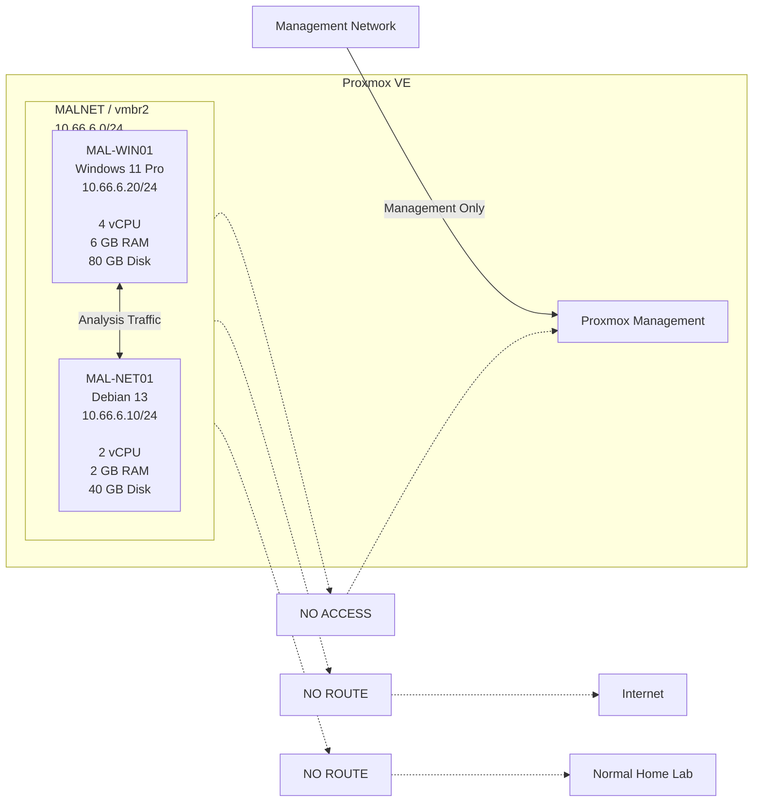

# Malware Analysis Lab

A minimal, isolated malware analysis environment built on Proxmox VE for
static analysis, dynamic analysis, host monitoring, and simulated network
observation.

The project intentionally starts small.

The first version consists of:

- one Windows analysis VM
- one Linux network simulation VM
- one isolated virtual network
- snapshot-based recovery
- no Internet connectivity
- no routing into the normal homelab

The goal is to build a controlled and repeatable analysis environment before
adding more advanced infrastructure.

## Architecture



## Lab Components

| Component | Purpose |
|---|---|
| `MAL-WIN01` | Windows malware analysis and controlled execution |
| `MAL-NET01` | Simulated network services and traffic observation |
| `MALNET` | Isolated malware analysis network |
| `vmbr2` | Proxmox bridge used exclusively by MALNET |

## Network

```text
MALNET
Subnet:       10.66.6.0/24
Bridge:       vmbr2
Gateway:      NONE
Routing:      NONE
NAT:          NONE
Physical NIC: NONE
```

Hosts:

```text
10.66.6.10    MAL-NET01
10.66.6.20    MAL-WIN01
```

The core network rule is deliberately simple:

```text
MAL-WIN01 <-> MAL-NET01

and nowhere else.
```

## Scope

### Included in v0.1

- static malware analysis
- dynamic malware analysis
- process observation
- filesystem observation
- registry observation
- network traffic capture
- simulated Internet services
- debugging
- snapshot-based recovery

### Explicitly excluded from v0.1

- Active Directory
- SIEM infrastructure
- SOC infrastructure
- EDR fleet
- attacker infrastructure
- Internet-facing services
- automated malware detonation
- threat intelligence platforms
- malware zoo infrastructure
- Kubernetes
- Elasticsearch
- "just one more VM"

## Documentation

Detailed documentation can be found in:

- [`docs/architecture.md`](docs/architecture.md)
- [`docs/network.md`](docs/network.md)
- [`docs/software-stack.md`](docs/software-stack.md)
- [`docs/threat-model.md`](docs/threat-model.md)
- [`docs/workflow.md`](docs/workflow.md)

## Repository Structure

```text
malware-analysis-lab/
├── README.md
├── configs/
│   ├── linux/
│   └── windows/
├── docs/
│   ├── architecture.md
│   ├── network.md
│   ├── software-stack.md
│   ├── threat-model.md
│   └── workflow.md
├── logbook/
└── scripts/
```

## Design Principle

Every new component must provide an analysis capability that the existing
two-VM architecture cannot provide.

If it cannot answer that question, it does not enter v0.1.