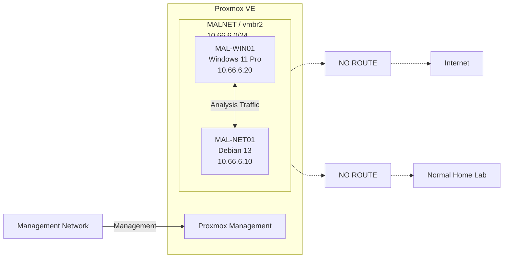

# Architecture

## Objective

The malware analysis lab provides a small, reproducible environment for
observing potentially malicious software without exposing the normal homelab
or external networks.

Version 0.1 intentionally uses only two virtual machines.

## Architecture



## MAL-WIN01

Purpose:

- malware execution
- static analysis
- dynamic analysis
- process monitoring
- registry monitoring
- filesystem monitoring
- debugging

Planned configuration:

```text
OS:           Windows 11 Pro
vCPU:         4
RAM:          6 GB
Disk:         80 GB

NIC0:         vmbr2
IP:           10.66.6.20/24
Gateway:      NONE
DNS:          10.66.6.10

TPM:          Enabled
Secure Boot:  Enabled
QEMU Agent:   Enabled
Snapshots:    Enabled
```

## MAL-NET01

Purpose:

- simulated network services
- DNS simulation
- HTTP and HTTPS simulation
- packet capture
- traffic observation

Planned configuration:

```text
OS:           Debian 13
vCPU:         2
RAM:          2 GB
Disk:         40 GB

NIC0:         vmbr2
IP:           10.66.6.10/24
Gateway:      NONE

GUI:          No
QEMU Agent:   Enabled
Snapshots:    Enabled
```

MAL-NET01 is not a router.

IP forwarding, NAT, or bridging between MALNET and other networks must not be
enabled.

## Resource Budget

```text
Virtual Machines:  2
Virtual Networks:  1

Total vCPU:        6
Total RAM:         8 GB
Total Storage:     120 GB
Virtual NICs:      2

Gateways:          0
Physical MALNET
interfaces:        0
```

## Scope Boundary

The lab architecture must remain independent from the normal homelab.

Hosting the VMs on Proxmox does not imply that malware network traffic may
reach the Proxmox management interface.