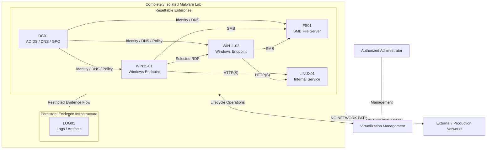
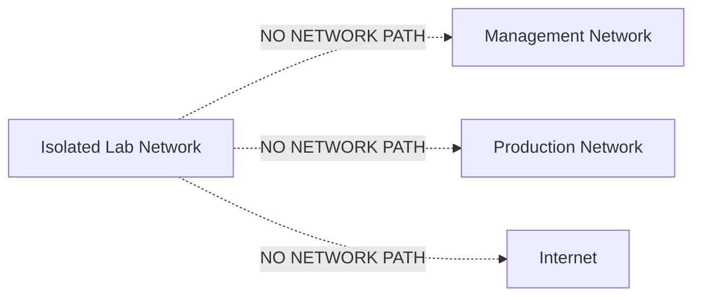
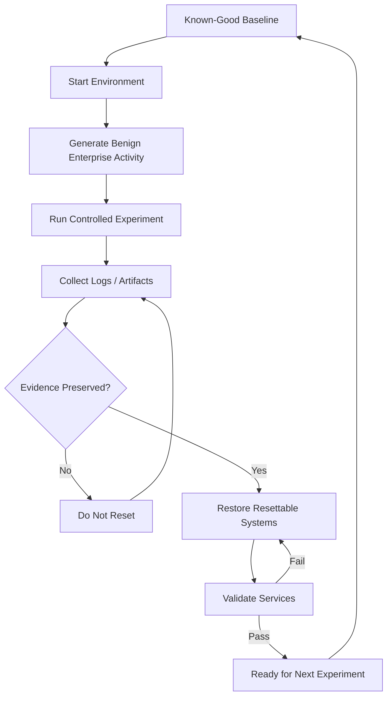

# Enterprise Malware Analysis Lab Design

> Public-facing design report. Organization-specific identifiers, internal
> addresses, bridge names, physical host details, proprietary telemetry
> components, and operational transfer procedures have been intentionally
> generalized or omitted.

## Purpose

This document describes the design of a resettable, enterprise-style malware
analysis environment built on a virtualization platform.

The goal is to create enough realistic enterprise behaviour to support useful
dynamic analysis while keeping the environment understandable, repeatable, and
strongly isolated.

The design assumes that systems inside the experiment boundary may become fully
compromised.

## Design Goals

The environment is designed around six goals:

- realistic Windows enterprise behaviour
- strong isolation from management and production networks
- repeatable experiments from known-good baselines
- persistent evidence collection across resets
- controlled internal lateral communication
- small enough scope to be maintained by one researcher

A core principle is:

> Realism is measured by useful system relationships rather than by the number
> of installed enterprise products.

## High-Level Architecture

The important distinction is between **lifecycle** and **network trust**.

- The resettable enterprise can be modified, compromised, or destroyed.
- The evidence system survives experiment resets.
- The evidence system still remains inside the isolated lab.
- Virtualization management remains outside the guest network.

## System Roles

| System | Role | Lifecycle |
|---|---|---|
| `DC01` | Active Directory Domain Services, DNS, Group Policy | Resettable |
| `FS01` | SMB file services | Resettable |
| `WIN11-01` | Windows user endpoint | Resettable |
| `WIN11-02` | Windows user endpoint | Resettable |
| `LINUX01` | Simple internal HTTP(S) service | Resettable |
| `LOG01` | Persistent telemetry and artifact storage | Persistent |

The public design intentionally omits the real deployment's address plan and
host-specific virtualization configuration.

## Network Isolation

The malware environment uses an internal virtual switching domain with no
direct attachment to a physical production network.

The baseline design requires:

- no physical uplink from the malware-lab virtual switch
- no guest default gateway
- no NAT
- no external routing
- no external DNS forwarding
- no dependency on production DHCP
- no guest interface attached to a management or production-facing bridge
- no temporary production-facing NIC for updates or troubleshooting
- no network path from malware-lab guests to virtualization management

This makes isolation an architectural property rather than something that
depends only on guest firewall configuration.

Required tools, updates, and configuration are prepared before a system becomes
part of an operational analysis baseline or are introduced through a separately
controlled offline transfer process.

## Enterprise Behaviour

The lab is intentionally Microsoft-oriented because a small domain environment
produces useful identity, authentication, policy, and file-service activity
without requiring cloud dependencies.

Milestone 1 includes:

- Active Directory Domain Services
- internal DNS
- a minimal Group Policy baseline
- two Windows endpoints
- an SMB file server
- selected RDP usage
- one simple Linux-hosted internal service
- persistent evidence collection

This provides representative traffic such as:

- Kerberos authentication
- LDAP queries
- internal DNS resolution
- Group Policy processing
- SMB authentication and file access
- endpoint-to-endpoint communication
- HTTP(S) access to an internal service

Two Windows endpoints are used because multi-host behaviour such as discovery,
remote access, credential reuse, and lateral activity cannot be represented by
a single workstation.

## Reset Model

Every experiment starts from a documented known-good state.

A destructive reset must not occur until required evidence has been preserved.

The definition of a successful reset is therefore not simply "the VMs boot".
The environment must return to a known state, core services must function, and
the next experiment must be able to run reproducibly.

## Threat Model

The design assumes complete compromise of one or more resettable guests.

A malicious sample may be able to obtain:

- local administrator or SYSTEM privileges
- domain credentials
- domain administrator privileges
- access to internal file shares
- access to other resettable systems
- access to services intentionally exposed by the evidence infrastructure

The design does **not** assume malware will respect:

- guest firewall rules
- user permissions
- local administrative restrictions
- intended host roles

### Behaviour Accepted Inside the Experiment Boundary

The following may be valid research behaviour:

- guest compromise
- domain compromise
- credential theft involving lab-only credentials
- lateral movement
- host discovery
- service discovery
- persistence inside resettable systems
- destructive modification of resettable guests
- internal network scanning

These become containment failures only when they cross an intended trust
boundary.

### Security Invariants

The baseline design requires that:

- resettable guests cannot reach production networks
- resettable guests cannot reach virtualization management
- resettable guests cannot reach the public Internet
- production credentials are never used inside the lab
- persistent evidence survives experiment resets
- reset operations require successful evidence preservation
- operational baselines contain no temporary external connectivity

The virtualization layer remains an important residual security boundary.
Virtualization is therefore not described as a physical air gap.

## Persistent Evidence

`LOG01` exists outside the normal reset lifecycle so that experiment evidence
survives restoration of the simulated enterprise.

Potential evidence includes:

- Windows Event Logs
- endpoint telemetry
- Linux logs
- service logs
- experiment metadata
- hashes
- selected packet captures
- later analysis artifacts

Persistent does not mean trusted.

Resettable systems may communicate with the evidence service, so the collection
interface should minimize exposed protocols, credentials, writable locations,
administrative interfaces, and unnecessary bidirectional communication.

Where practical, resettable systems should not be able to modify previously
stored evidence.

## Resource Planning

The first enterprise milestone is intentionally small.

Typical VM sizing is expected to remain in the range of:

- 2-4 vCPU per system
- 2-6 GB RAM per system
- approximately 30-100 GB virtual disk per system

Actual physical host capacity and production deployment details are intentionally
not included in this public report.

## Scope Control

Several realistic enterprise services are deliberately deferred.

Examples include:

- Exchange Server
- SharePoint Server
- SQL Server
- IIS application infrastructure
- AD CS
- full Remote Desktop Services
- SIEM infrastructure
- full EDR infrastructure
- automated malware detonation
- extensive historical patch-state matrices

A new service should only be introduced when it provides a research capability
that the existing environment cannot provide.

## Public-Sanitization Notes

The private operational documentation contains additional implementation detail.

This public report deliberately excludes or generalizes:

- organization and staff names
- exact internal IP addressing
- real bridge and interface identifiers
- physical host model and capacity
- management-network details
- production-network topology
- internal repository locations
- proprietary monitoring component details
- credentials, secrets, tokens, and key material
- exact artifact-transfer procedures
- operational malware samples

The intent is to document architecture and engineering decisions without
publishing organization-specific infrastructure information.

## References

The design research used publicly available Microsoft documentation:

- [Active Directory Domain Services overview](https://learn.microsoft.com/en-us/windows-server/identity/ad-ds/active-directory-domain-services)
- [DNS and AD DS](https://learn.microsoft.com/en-us/windows-server/identity/ad-ds/plan/dns-and-ad-ds)
- [SMB file sharing overview](https://learn.microsoft.com/en-us/windows-server/storage/file-server/file-server-smb-overview)
- [SMB security hardening](https://learn.microsoft.com/en-us/windows-server/storage/file-server/smb-security-hardening)
- [Remote Desktop Services overview](https://learn.microsoft.com/en-us/windows-server/remote/remote-desktop-services/overview)
- [Exchange Server Subscription Edition](https://learn.microsoft.com/en-us/exchange/new-features/new-features)
- [SharePoint Server Subscription Edition single-server installation](https://learn.microsoft.com/de-de/sharepoint/install/installing-sharepoint-subscription-edition-on-one-server)
- [Microsoft 365 Business Premium FAQ](https://learn.microsoft.com/en-us/microsoft-365/business-premium/microsoft-365-business-faqs?view=o365-worldwide)
