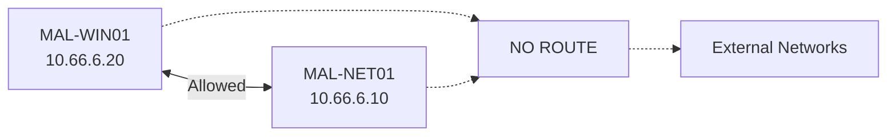

# Network Design

## MALNET

MALNET is the dedicated malware analysis network.

```text
Bridge:       vmbr2
Subnet:       10.66.6.0/24
Gateway:      NONE
NAT:          NONE
Routing:      NONE
Physical NIC: NONE
```

The bridge exists only inside Proxmox.

It is not attached to a physical network interface.

## Addressing

| Host | Address | Purpose |
|---|---|---|
| MAL-NET01 | `10.66.6.10/24` | Network simulation |
| MAL-WIN01 | `10.66.6.20/24` | Analysis target |

## DNS

MAL-WIN01 uses:

```text
DNS: 10.66.6.10
```

This allows MAL-NET01 to answer DNS requests generated during malware
analysis.

## Gateway

Neither VM receives a default gateway.

```text
MAL-WIN01
Gateway: NONE

MAL-NET01
Gateway: NONE
```

Without a default gateway, traffic destined outside the local subnet has no
route.

## Traffic Model



Allowed:

```text
MAL-WIN01 <-> MAL-NET01
```

Not allowed:

```text
MAL-WIN01 -> Internet
MAL-WIN01 -> Home Lab
MAL-WIN01 -> Proxmox Management

MAL-NET01 -> Internet
MAL-NET01 -> Home Lab
MAL-NET01 -> Proxmox Management
```

## Routing

MAL-NET01 must not provide:

- IP forwarding
- NAT
- masquerading
- routing
- VPN connectivity
- Internet forwarding

The machine simulates network services.

It does not provide actual Internet access.

## Proxmox Bridge

Planned layout:

```text
Proxmox VE

vmbr0
└── Management / normal infrastructure
    └── Physical NIC

vmbr2
└── MALNET
    ├── No physical NIC
    ├── No gateway
    ├── MAL-NET01
    └── MAL-WIN01
```

There must be no bridge or routing relationship between `vmbr0` and `vmbr2`.