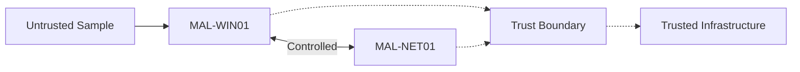

# Threat Model

## Objective

The lab assumes that software executed inside MAL-WIN01 may be hostile.

The design therefore attempts to minimize the number of systems and networks
that an analyzed sample can interact with.

## Primary Assets

Assets that must be protected include:

- Proxmox management
- normal homelab systems
- personal devices
- external networks
- credentials
- host filesystem data
- unrelated virtual machines

## Primary Threat

The primary threat is malware executed inside MAL-WIN01 attempting to escape
its intended analysis environment.

Potential behavior includes:

- network scanning
- credential theft
- persistence
- lateral movement
- command-and-control communication
- exploitation attempts
- data destruction
- sandbox detection

## Trust Boundaries

## Isolation Requirements

The malware analysis network must not have:

- Internet routing
- access to the normal homelab
- access to Proxmox management
- shared host directories
- shared clipboard functionality
- unnecessary USB passthrough
- physical network interfaces
- credentials used elsewhere

## Failure Assumption

The lab assumes that MAL-WIN01 may become fully compromised during analysis.

The recovery model therefore does not attempt to clean the machine.

The machine is reverted to a known-clean snapshot.

## Sample Handling

Actual malware samples must not be committed to this Git repository.

The repository may contain:

- hashes
- metadata
- analysis notes
- sanitized logs
- YARA rules
- configuration files
- scripts
- indicators of compromise

Raw samples are handled separately from source control.

## Core Security Principle

Compromise of MAL-WIN01 must not imply compromise of any other environment.