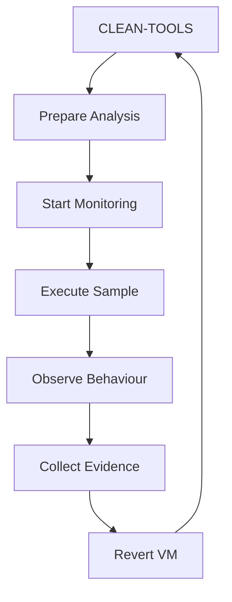

# Analysis Workflow

## Overview

Each malware analysis session begins from a known-clean state.



## 1. Prepare

Start MAL-WIN01 from the `CLEAN-TOOLS` snapshot.

Confirm:

- MALNET connectivity
- no default gateway
- MAL-NET01 availability
- monitoring tools available

## 2. Record Sample Information

Before execution, record at minimum:

```text
Filename
SHA256
Sample source
Analysis date
Analyst notes
```

## 3. Static Analysis

Perform basic static inspection before execution.

Possible observations include:

- PE metadata
- imports
- strings
- embedded resources
- file hashes
- signatures

## 4. Start Monitoring

Start required monitoring before running the sample.

Monitoring may include:

- process activity
- filesystem activity
- registry activity
- network capture
- simulated network services

## 5. Execute

Execute the specimen only inside MAL-WIN01.

The specimen must remain within the isolated analysis environment.

## 6. Observe

Observe behaviour such as:

- spawned processes
- filesystem modifications
- registry modifications
- persistence attempts
- DNS requests
- network connections
- dropped files
- process injection indicators

## 7. Collect Evidence

Export relevant evidence before reverting the machine.

Possible evidence includes:

- screenshots
- logs
- hashes
- packet captures
- process trees
- registry changes
- dropped file hashes
- notes

## 8. Revert

After evidence has been collected:

```text
Stop analysis
        |
        v
Revert MAL-WIN01
        |
        v
CLEAN-TOOLS
```

Do not attempt to manually clean the infected analysis VM.

## Snapshot Strategy

### MAL-WIN01

```text
CLEAN-OS
   |
   v
CLEAN-TOOLS
   |
   v
ANALYSIS-TEMP
```

`CLEAN-OS`

Windows installed and configured.

`CLEAN-TOOLS`

Analysis tooling installed and verified.

This is the normal analysis baseline.

`ANALYSIS-TEMP`

Temporary state created for a specific analysis session.

### MAL-NET01

```text
CLEAN-OS
   |
   v
CLEAN-TOOLS
```

MAL-NET01 should normally remain clean.

## Backup Policy

Back up known-clean states only.

```text
Allowed:

CLEAN-OS
CLEAN-TOOLS
```

Do not include active malware analysis states in normal backup jobs.